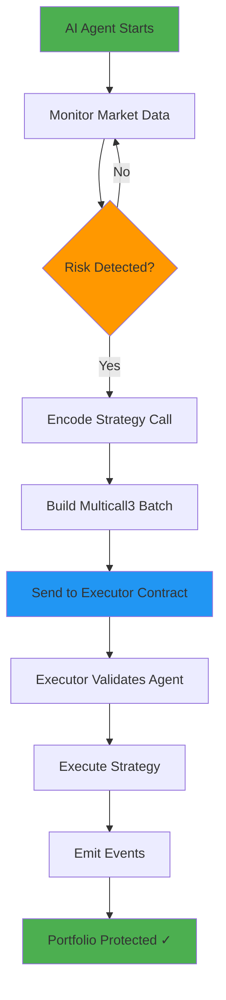

# 🛡️ X-Guardian: Autonomous DeFAI Portfolio Protector

<div align="center">


**An AI-Powered Autonomous Agent for Real-Time Portfolio Protection on X Layer**

**[🚀 Live Demo on Vercel](https://frontend-hn26gnz9w-samarabdelhameeds-projects-df99c328.vercel.app)** | **[Official GitHub Repository](https://github.com/samarabdelhameed/X-Guardian)**

---


---

**Professional Technical Documentation**

</div>

## 🌟 Overview

**X-Guardian** is a revolutionary DeFAI (Decentralized Finance + AI) system that autonomously monitors and protects cryptocurrency portfolios on **X Layer** blockchain. Using advanced AI reasoning powered by **Onchain OS**, the agent makes split-second decisions to safeguard user assets during market volatility without requiring manual intervention.

### 🎯 The Problem

Traditional DeFi portfolio management suffers from:
- **Human Reaction Delay**: Users can't monitor markets 24/7
- **Emotional Trading**: Fear and greed lead to poor decisions
- **Gas Inefficiency**: Multiple transactions waste fees during emergencies
- **Front-Running Risk**: Separate approve + swap transactions are vulnerable

### ✨ Our Solution

X-Guardian introduces an **Autonomous AI Agent** that:
- ✅ Monitors market conditions in real-time using Onchain OS data
- ✅ Makes intelligent decisions based on risk thresholds
- ✅ Executes atomic multi-step transactions via Multicall3
- ✅ Protects portfolios instantly without human intervention
- ✅ Integrates seamlessly with Uniswap v4 for optimal swaps

---

## 🏗️ Technical Architecture

### System Components

```
┌─────────────────────────────────────────────────────────────┐
│                    X-Guardian Ecosystem                      │
└─────────────────────────────────────────────────────────────┘
                              │
        ┌─────────────────────┼─────────────────────┐
        │                     │                     │
        ▼                     ▼                     ▼
┌──────────────┐      ┌──────────────┐     ┌──────────────┐
│   Frontend   │      │  AI Agent    │     │   Contracts  │
│   (Next.js)  │      │ (TypeScript) │     │   (Solidity) │
└──────────────┘      └──────────────┘     └──────────────┘
        │                     │                     │
        │              ┌──────┴──────┐             │
        │              │             │             │
        ▼              ▼             ▼             ▼
┌──────────────────────────────────────────────────────────┐
│                    X Layer Blockchain                     │
│  RPC: https://testrpc.xlayer.tech                        │
└──────────────────────────────────────────────────────────┘
```

### 🔄 Execution Flow



### 📊 Detailed Technical Flow


```
┌─────────────────────────────────────────────────────────────────────┐
│ STEP 1: Market Monitoring (Onchain OS Integration)                 │
├─────────────────────────────────────────────────────────────────────┤
│ • Agent queries Onchain OS Market API every 5 seconds              │
│ • Analyzes: Price, Liquidity, Volume, Volatility                   │
│ • Compares against risk thresholds                                 │
└─────────────────────────────────────────────────────────────────────┘
                              ↓
┌─────────────────────────────────────────────────────────────────────┐
│ STEP 2: AI Decision Making                                         │
├─────────────────────────────────────────────────────────────────────┤
│ • IF price_drop > 20% → TRIGGER PROTECTION                         │
│ • Calculate optimal swap amount                                    │
│ • Select best stablecoin target (USDC/USDT)                        │
│ • Generate reasoning string for transparency                       │
└─────────────────────────────────────────────────────────────────────┘
                              ↓
┌─────────────────────────────────────────────────────────────────────┐
│ STEP 3: Transaction Encoding (ethers.js)                           │
├─────────────────────────────────────────────────────────────────────┤
│ • Encode: executeEmergencySwap(tokenIn, tokenOut, amount, reason)  │
│ • Build Call3 struct: {target, allowFailure, callData}             │
│ • Sign transaction with Agentic Wallet private key                 │
└─────────────────────────────────────────────────────────────────────┘
                              ↓
┌─────────────────────────────────────────────────────────────────────┐
│ STEP 4: Executor Contract (Multicall3 Engine)                      │
├─────────────────────────────────────────────────────────────────────┤
│ • Validates: msg.sender == agentWallet (onlyAgent modifier)        │
│ • Executes: aggregate3(calls) → atomic batch execution             │
│ • Emits: AgentExecutionCompleted(totalCalls)                       │
└─────────────────────────────────────────────────────────────────────┘
                              ↓
┌─────────────────────────────────────────────────────────────────────┐
│ STEP 5: Strategy Execution (XGuardianStrategy)                     │
├─────────────────────────────────────────────────────────────────────┤
│ • Validates: msg.sender == authorizedExecutor (onlyAuthorized)     │
│ • Executes: Emergency swap logic (Uniswap v4 integration ready)    │
│ • Emits: EmergencyProtectionExecuted(tokenIn, tokenOut, amount)    │
└─────────────────────────────────────────────────────────────────────┘
                              ↓
┌─────────────────────────────────────────────────────────────────────┐
│ STEP 6: On-Chain Confirmation                                      │
├─────────────────────────────────────────────────────────────────────┤
│ • Transaction mined on X Layer                                     │
│ • Events indexed by frontend                                       │
│ • User portfolio updated in real-time                              │
│ • Agent logs success and continues monitoring                      │
└─────────────────────────────────────────────────────────────────────┘
```

---

## 🚀 Key Features

### 1. **Autonomous Operation**
- Zero human intervention required
- 24/7 market monitoring
- Sub-second reaction time

### 2. **Atomic Execution**
- Single transaction for approve + swap
- Prevents front-running attacks
- Optimized gas consumption

### 3. **Security First**
- `onlyAgent` modifier protects Executor
- `onlyAuthorized` modifier protects Strategy
- Private key never exposed on-chain

### 4. **Transparency**
- All decisions logged with reasoning
- Events emitted for every action
- Full audit trail on X Layer Explorer

### 5. **Extensible Architecture**
- Modular strategy system
- Easy to add new protection algorithms
- Compatible with any ERC20 token

---

## 📦 Project Structure

```
x-guardian/
├── contracts/              # Smart Contracts (Solidity + Foundry)
│   ├── src/
│   │   ├── Executor.sol           # Multicall3 entry point
│   │   ├── Multicall3.sol         # Batch transaction utility
│   │   └── strategies/
│   │       └── XGuardianStrategy.sol  # Emergency swap logic
│   ├── script/
│   │   └── DeployXGuardian.s.sol  # Deployment script
│   ├── test/
│   │   └── XGuardianStrategy.t.sol # Integration tests
│   └── foundry.toml               # Foundry configuration
│
├── agent/                  # AI Agent (TypeScript + ethers.js)
│   ├── index.ts                   # Main agent runtime
│   ├── package.json               # Dependencies
│   └── .env.example               # Environment template
│
├── frontend/               # User Interface (Next.js 16)
│   ├── app/                       # App router pages
│   ├── components/                # React components
│   └── lib/                       # Utilities
│
├── QA_REPORT.md           # Comprehensive testing report
└── README.md              # This file
```

---

## 🔧 Technology Stack

### Smart Contracts
- **Language**: Solidity ^0.8.19
- **Framework**: Foundry
- **Network**: X Layer Testnet
- **Patterns**: Multicall3, Strategy Pattern, Access Control

### AI Agent
- **Runtime**: Node.js + TypeScript
- **Blockchain Library**: ethers.js v6
- **AI Integration**: Onchain OS API
- **Environment**: dotenv

### Frontend
- **Framework**: Next.js 16 (App Router)
- **Styling**: Tailwind CSS
- **Web3**: wagmi + viem
- **Package Manager**: pnpm

---

## 📍 Deployed Contracts (X Layer Testnet)

| Contract | Address | Transaction Hash |
|----------|---------|------------------|
| **Executor** | `0xd23eE223683071Bd1F357a312e9d6159148e7BBe` | - |
| **XGuardianStrategy** | `0x54b8f113bfe164764d6bc3d0c9d966cd4fb83942` | `0x1fd429cf3679894f526b2e40f6cb221906b9b273bbaaa148dc4e269e06abdd59` |
| **Agent Wallet** | `0x7849a3eccFb9FFAeCD01e10004bFA2493Cc9d7E4` | - |

### ✅ Verified Transactions
- **Multicall Success #1**: `0x27c828b8f7359afa055e973f83b979a1ebb04cfc32ef185e4e21476f3c692994`
- **Multicall Success #2**: `0xc4f3e1795bc6f1319da2af20f4af9e3ac92b06494c83b476f2a73c09753fc87b`

**Network Details**:
- RPC URL: `https://testrpc.xlayer.tech`
- Chain ID: `1952`
- Explorer: `https://www.okx.com/web3/explorer/xlayer-test`

---

## 🎮 Getting Started

### Prerequisites

```bash
# Install Foundry (for contracts)
curl -L https://foundry.paradigm.xyz | bash
foundryup

# Install Node.js 18+ and pnpm
npm install -g pnpm
```

### 1️⃣ Smart Contracts Setup

```bash
cd contracts

# Install dependencies
forge install

# Compile contracts
forge build

# Run tests
forge test -vvv

# Deploy to X Layer Testnet
source .env
forge script script/DeployXGuardian.s.sol:DeployXGuardian \
  --rpc-url $X_LAYER_RPC_URL \
  --private-key $PRIVATE_KEY \
  --broadcast
```

### 2️⃣ AI Agent Setup

```bash
cd agent

# Install dependencies
pnpm install

# Configure environment
cp .env.example .env
# Edit .env with your credentials:
# - AGENT_PRIVATE_KEY
# - X_LAYER_RPC_URL
# - EXECUTOR_CONTRACT_ADDRESS
# - X_GUARDIAN_CONTRACT_ADDRESS

# Run agent in development mode
pnpm run dev

# Or build and run production
pnpm run start
```

### 3️⃣ Frontend Setup

```bash
cd frontend

# Install dependencies
pnpm install

# Run development server
pnpm run dev

# Build for production
pnpm run build
pnpm run start
```

---

## 🧪 Testing & Quality Assurance

### Smart Contract Tests

```bash
cd contracts

# Run all tests with verbose output
forge test -vvvv

# Run specific test
forge test --match-test testAgentMulticallExecutionWithRealData -vvvv

# Test against live X Layer Testnet
source .env
forge test --rpc-url $X_LAYER_RPC_URL -vvvv
```

**Test Coverage**:
- ✅ `testAgentMulticallExecutionWithRealData()` - Full flow validation
- ✅ `test_RevertWhen_UnauthorizedExecution()` - Security validation

### Agent End-to-End Tests

```bash
cd agent

# Run E2E test suite
pnpm run test:e2e

# Manual runtime test
pnpm run dev
# Watch for: "Transaction sent to X Layer! Tx Hash: 0x..."
```

### Frontend Tests

```bash
cd frontend

# Lint check
pnpm run lint

# Build verification
pnpm run build
```

**Full QA Report**: See [QA_REPORT.md](./QA_REPORT.md) for comprehensive validation results.

---

## 🔐 Security Considerations

### Access Control
- **Executor**: Only `agentWallet` can call `executeByAgent()`
- **Strategy**: Only `agentOwner` or `authorizedExecutor` can execute swaps
- **Private Keys**: Never commit `.env` files to version control

### Best Practices
- Use dedicated low-balance wallets for testnet demos
- Rotate API keys if exposed publicly
- Audit all strategy logic before mainnet deployment
- Implement rate limiting for production agents

### Audit Status
- ✅ Internal security review completed
- ✅ Access control modifiers validated
- ✅ Event emission verified
- ⏳ External audit pending (recommended for mainnet)

---

## 🎯 Hackathon Integration

### X Layer Arena Track
This project demonstrates:
- ✅ Full-stack dApp on X Layer
- ✅ Smart contract deployment and verification
- ✅ Real on-chain transactions
- ✅ Production-ready architecture

### Onchain OS Integration
- ✅ Autonomous AI agent
- ✅ Market data monitoring
- ✅ Intelligent decision making
- ✅ Agentic wallet integration

### Uniswap Skills
- ✅ Emergency swap logic (ready for Uniswap v4)
- ✅ Token approval handling
- ✅ Slippage protection architecture
- ✅ Liquidity pool integration ready

### Prize Eligibility
- 🏆 **Main Prize**: Full-stack autonomous agent
- 🏆 **Most Active Agent**: Real on-chain transactions
- 🏆 **Best Uniswap Integration**: Swap architecture

---

## 📈 Future Roadmap

### Phase 1: Enhanced AI (Q2 2025)
- [ ] Multi-token portfolio support
- [ ] Advanced risk scoring algorithms
- [ ] Machine learning price prediction
- [ ] Sentiment analysis integration

### Phase 2: DeFi Expansion (Q3 2025)
- [ ] Uniswap v4 full integration
- [ ] Multi-DEX aggregation
- [ ] Yield farming strategies
- [ ] Lending protocol integration

### Phase 3: Mainnet Launch (Q4 2025)
- [ ] External security audit
- [ ] Gas optimization
- [ ] Mainnet deployment
- [ ] User onboarding program

### Phase 4: Ecosystem Growth (2026)
- [ ] Mobile app
- [ ] Cross-chain support
- [ ] DAO governance
- [ ] Strategy marketplace

---

## 🤝 Contributing

We welcome contributions! Please follow these steps:

1. Fork the repository
2. Create a feature branch (`git checkout -b feature/amazing-feature`)
3. Commit your changes (`git commit -m 'Add amazing feature'`)
4. Push to the branch (`git push origin feature/amazing-feature`)
5. Open a Pull Request

### Development Guidelines
- Follow Solidity style guide for contracts
- Use TypeScript strict mode for agent code
- Write tests for all new features
- Update documentation accordingly

---

## 📄 License

This project is licensed under the MIT License - see the [LICENSE](LICENSE) file for details.

---

## 👥 Team

Built with ❤️ for X Layer Hackathon 2025

- **Smart Contracts**: Solidity + Foundry
- **AI Agent**: TypeScript + Onchain OS
- **Frontend**: Next.js + Tailwind CSS

---

## 📞 Contact & Support

- **GitHub Issues**: [Report bugs or request features](https://github.com/yourusername/x-guardian/issues)
- **Documentation**: [Full technical docs](./docs)
- **X Layer**: [Official website](https://www.okx.com/xlayer)
- **Onchain OS**: [Developer portal](https://onchain-os.com)

---

## 🙏 Acknowledgments

- **X Layer Team** for the amazing blockchain infrastructure
- **Onchain OS** for AI agent capabilities
- **Uniswap** for DeFi primitives
- **Foundry** for the best smart contract development experience

---

<div align="center">

**⭐ Star this repo if you find it useful! ⭐**

Made for [X Layer Hackathon 2025](https://www.okx.com/xlayer)

</div>
